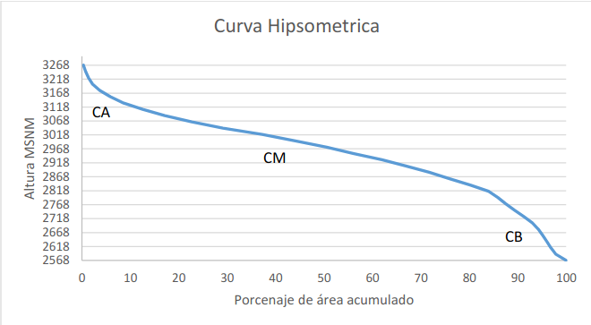
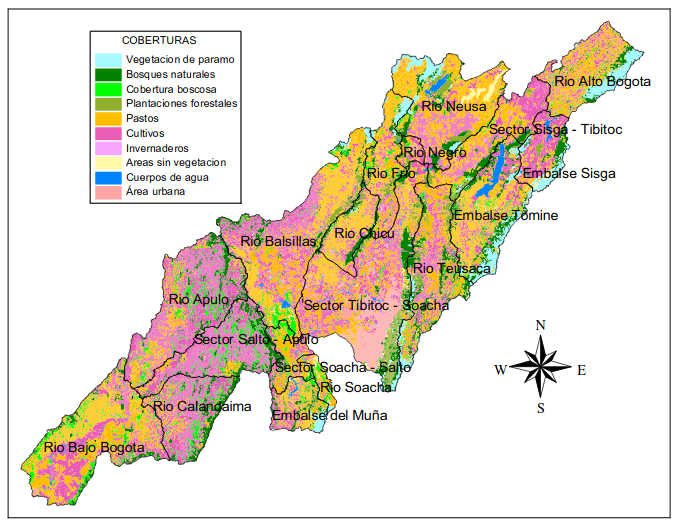

```{r setup, include=FALSE}
knitr::opts_chunk$set(echo = FALSE, 
                      message = FALSE, 
                      warning = FALSE,
                      library(tidyverse), 
                      library(gridExtra))
knitr::knit_hooks$set(plot = function (x, options) {
  float_correct <- function(f, y, opts)  {
    if (is.null(opts$regfloat) || opts$regfloat==FALSE)
      paste0(f(y, opts), "\n\n\\FloatBarrier\n")
    else
      f(y, opts)
  }
  if (!is.null(options$out.width) || !is.null(options$out.height) ||
      !is.null(options$out.extra) || options$fig.align != "default" ||
      !is.null(options$fig.subcap)) {
    if (is.null(options$fig.scap))
      options$fig.scap = NA
    return(float_correct(knitr:::hook_plot_tex, x, options))
  }
  return(float_correct(knitr:::hook_plot_md_base, x, options))
})
```

# Resúmen

La cuenca del río Bogotá es la unidad de estudio para que sirve de apoyo para los tomadores de decisiones. En este estudio se elaboró la caracterización completa de la cuenca del río Bogotá. La cual es alargada y en su mayoría de pendiente accidentada, esto hace que su caudal sea elevado y el tiempo de respuesta es corto. Desde su parte alta hay presencia de contaminantes nocivos para la vida, tales como metales pesados (Cadmio, plomo, mercurio, y arsénico) o residuos agroindustrales. Todo esto en conjunto con la poca cantidad de bosques naturales y la poca regulación de las actividades productivas o de extración concluyen en la necesidad de restaurar ecosistemas para un mejoramiento en la calidad de la misma, y una intervención más activa por parte de las Organizaciones que administran la cuenca del río Bogotá.

# Introducción

El río Bogotá es una cuenca que atraviesa parte de la zona central de Colombia, esta se sitúa en el departamento de Cundinamarca, empieza en el municipio de Villapinzón y desemboca en el río Magdalena [@Pinzon]. Está conformada por 19 subcuencas, y compuesta por un sistema natural de quebradas, ríos, lagunas, y humedales (en su mayoría afluentes del río Bogotá) [@calidad_neusa].
Diversos estudios han focalizado sus esfuerzos en analizar las influencias tanto de origen natural como antrópico de los sistemas hídricos. En las aguas del río Bogotá se evidencian todo tipo de influencias antrópicas, ejercicios como la tala de árboles, captación de aguas ilegales, depositos de residuos domésticos, residuos industriales y una predominante falta de interés por el uso responsable de sus aguas, la convierten en un referente de suciedad y contaminación a nivel mundial [@car_intro]. La importancia de su conservación aumenta si se considera el hecho de que esta cuenca abastece a más de 10 millones de habitantes de los 46 municipios que la conforman y desarrollan todo tipo de actividades socioeconómicas que le permiten subsistir en su diario vivir, así como todos los demás seres vivos que la habitan, cuya supervivencia depende de qué tan deteriorado se encuentre su ecosistema [@car_intro]. El presente estudio trata de analizar de la forma más minuciosa posible la cuenca del río Bogotá, y posteriormente elaborar una caracterización que abarque todos los aspectos que conforman a la cuenca como unidad (desde los factores morfométricos hasta los socioeconómicos), cuya consulta permita conocer su estado hasta la fecha de publicación del estudio. Adicionalmente se harán recomendaciones desde la perspectiva (y el campo que le compete) a la Ingeniería y las ciencias forestales que pueden servir como retroalimentación para los entes que se encargan del manejo de la cuenca del río Bogotá. 


# Metodología

- Polígonos en formato "shape" para la delimitación de la cuenca del río Bogotá, y las subcuencas que la conforman en el portal web (https://datosgeograficos.car.gov.co/datasets/ed418474401f49baa2931e35dd7a8919). Con estos se elaboró el mapa de la delimitación de la cuenca con su cauce principal, como de las subcuencas, todo por medio de las herramientas vectoriales del paquete básico de qgis.
- Imágenes satelitales LandSat 8 entre las coordenadas aproximadas (5.25, -73.65) y (4.26, -74.78) del 17 de Marzo del año 2018 para el mapa de coberturas (Información obtenida de U.S. Geological Survey). Se procesaron en los programas de sistemas de información geográfica QGIS [@QGIS_software]. Primero se hizo la corrección atmosférica para cada una de las dos imágenes con la extensión Semi-Automatic Classification Plugin (SCP), posteriormente se elaboró una clasificación de coberturas no supervisada con la extensión dzetsaka.
- Bases de datos de precipitación y temperatura del portal “datos.gov.co” y proporcionadas por POMCA Río Bogotá, se analizaron con el software estadístico R en su versión 4.0.3 [@R]. Se transformaron a formato largo con ayuda de la librería TidyR, se depuró y se obtuvo la información resúmen para cada subcuenca y la cuenca completa con la librería dplyr y se graficaron con la librería ggplot2, todas las librerías anteriores pertenecientes a la librería Tidyverse [@tidyverse].
- Para el presente artículo se utilizaron las planchas integradas de la cuenca del río Bogotá del Convenio "Fondo de adaptación" del Instituto Geológico Agustín Codazzi (IGAC) a escala 1:25.000, con información de redes de drenajes y curvas de nivel disponibles en su sitio web (https://geoportal.igac.gov.co/contenido/convenios-igac) [@convenio_igac]. Se obtuvo la morfometría de la cuenca, mediante la tabla de atributos que estos mismos tenían, y aplicando las fórmulas que se mencionan a continuación. Posteriormente se elaboró la tabla resúmen con la librería kableExtra [@kableextra] del lenguaje de programación R.

- **(P):** Longitud de la divisoria de aguas, o perímetro.

- **(L):** Longitud de la cuenca.

- **Ancho de la cuenca (B):** Es la relación entre el área y la longitud de la cuenca.
 
$$B = \dfrac{A}{L}$$
 
- **Factor de forma (Kf):** Es la relación entre el área y el cuadrado de la longitud de la cuenca. Se busca determinar qué tan cuadrada o alargada es una cuenca.
 
$$Kf = \dfrac{A}{{L}^2}$$
 
Si $Kf>1$, entonces la cuenca es más achatada, por lo que tiene un río principal más corto y un mayor riesgo de crecidas.


- **Coeficiente de compacidad (Kc):** Es la relación entre el perímetro de la cuenca (P) y la longitud de la circunferencia de un círculo de igual área a la de la cuenca.

Si $Kc=1$, entonce la cuenca es circular.

$$Kc = 0.28\dfrac{P}{{A}^{1/2}}$$
 
Si $Kc \approx 1$, habrá una tendencia a concetrar mayores volúmenes de agua.
 
 
- **Tiempo de concentración (Tc):** El tiempo que tarda una gota de agua en fluir desde el punto más remoto hasta la salida de la cuenca. O el tiempo mínimo necesario para que toda la cuenca esté aportando agua al punto de salida (según Kirpich). Generalmente está expresada en minutos. Una fórmula generalizada para hallar el tiempo de concentración es:

$$Tc = 0,066{\dfrac{L}{\sqrt{S_0}}}^{0,77}$$
Pero para la cuenca del río Bogotá, se elaboró un ajuste que concluye en la siguiente ecuación. 

$$Tc = {\left(11.9 \times \frac{{(\frac{L}{1.6})}^3}{0.3}\right)}^{0.385}$$
\newpage

# Resultados

## Morfometría

```{r fig.cap='Mapa de drenajes de la cuenca del rio Bogotá.'}
knitr::include_graphics("Cuenca_rio_bogota_drenajes.png")
```

En su mayoría, la cuenca del río Bogotá se sitúa en altitudes mayores a los 2500 m de altitud (Ver Figura 2.), un poco menos de su tercera parte está por debajo de 2500 m de altitud, correspondiéndole estas altitudes inferiores a la desembocadura de la misma. Esto en cierto modo explica las temperaturas medias bajas que allí se presentan.

```{r fig.cap='Perfil Longitudinal', out.width='70%', fig.align='center'}
knitr::include_graphics("perfil_longitudinal.png")
```

En la Figura 3 se observa un río maduro y estable, no hay aporte de sedimentos, más sí de socavamiento. El 70% de la cuenca del Río Bogotá se encuentra por debajo de los 3100 msnm, por lo que todo uso del suelo o plantaciones debe enfocarse por debajo de esta altitud.

```{r fig.cap='Curva hipsométrica (Tomado de @CAR)', out.width='70%', fig.align='center'}

```
En la Figura 4 se observa que la mayor área de la cuenca presenta un relieve fuertemente ondulado a fuertemente quebrado, el grado de la pendiente para la cuenca del río Bogotá nos muestra que se tiene a la pendiente como factor determinante de la respuesta a los eventos de precipitación y crecidas.

```{r fig.cap='Distribución  de  los  diferentes  rangos  de  pendiente,  extensión  territorial  y porcentual para la totalidad de la cuenca del río Bogota  (Tomada de Consorcio Planeación Ecológica – Ecoforest. 2006.)'}
knitr::include_graphics("pendientes_tabla.png")
```
En la Figura 5 tenemos un reúmen de los parámetros morfométricos, de los que se interpreta: 

- El factor de forma nos indica que la cuenca tiene una forma alargada, lo que indica un mayor tiempo de reacción en caso de crecidas.
- El coeficiente de compacidad refuerza lo dicho en el punto anterior, pues un valor de (1) nos indica que la cuenca tendría una forma de círculo perfecto, pero a medida que aumenta se tiende a alargar.
- La pendiente media muestra que es un terreno accidentado.
- El tiempo de reacción para la cuenca es consecuente con la predominancia del terreno escarpado mencionado en el apartado anterior.


```{r fig.cap='Parámetros morfométricos', out.width='50%', fig.align='center'}
knitr::include_graphics("morfometria.png")
```


## Climatología

Para los análisis climatológicos se diferencian las subcuencas que componen el río Bogotá, pues si bien la cuenca del río Bogotá es la unidad a estudiar. La cuenca del río Bogotá está constituida por 19 subcuencas (Ver Figura 6.), todas estas presentan condiciones climáticas heterogéneas que es necesario tener en cuenta para los posteriores análisis.

```{r fig.cap='Subcuencas de la cuenca del río Bogotá.'}
knitr::include_graphics("Subcuencas.png")
```

Las temperaturas medias más altas para la cuenca (Ver Figura 7.) se presentan en el río Apúlo, río Bogotá, río Calandaima, río Negro, y río Magdalena. En el caso del río Bogotá, al estar cerca a las áreas más pobladas de la cuenca, y debido al cambio de coberturas vegetales por otros de índole urbana como cemento, ladrillos, asfalto, han ido apareciendo pequeñas islas térmicas o islas de calor que tienden a expandirse conforme se expande la población hacia la periferia [@islas_calor]. En otros casos como en el río Calandaima, la ganadería, la producción agrícola y los diversos cultivos han modificado la cobertura vegetal [@calor_calandaima]. Por lo que a grandes rasgos, los aumentos de temparutura están altamente influenciados por el cambio de coberturas vegetales.

```{r fig.cap='Temperaturas medias de las subcuencas del río Bogotá'}
t_mean <- read.csv("Temperaturas_Medias.csv") %>%
  pivot_longer(
    ENERO:DICIEMBRE, 
    names_to = "MES", 
    values_to = "Tc"
  ) %>% 
  mutate(MES = as.factor(MES), 
         AÑO = as.factor(as.character(AÑO))) %>% 
  arrange(match(MES, c("ENERO", "FEBRERO", "MARZO", "ABRIL", 
                       "MAYO", "JUNIO", "JULIO", "AGOSTO", 
                       "SEPTIEMBRE", "OCTUBRE", "NOVIEMBRE", 
                       "DICIEMBRE"))) %>% 
  mutate(MES = fct_recode(MES, "1" = "ENERO", 
                          "2" = "FEBRERO", 
                          "3" = "MARZO", 
                          "4" = "ABRIL", 
                          "5" = "MAYO", 
                          "6" = "JUNIO", 
                          "7" = "JULIO", 
                          "8" = "AGOSTO", 
                          "9" = "SEPTIEMBRE", 
                          "10" = "OCTUBRE", 
                          "11" = "NOVIEMBRE", 
                          "12" = "DICIEMBRE")) %>% 
  filter(Tc <38)

t_mean$CUENCA <- iconv(t_mean$CUENCA, from = 'UTF-8', to = 'ASCII//TRANSLIT')

t_mean %>% 
  ggplot(data = ., mapping = aes(y = Tc, x = MES)) +
  geom_line() + facet_wrap(~ CUENCA) + aes(x = fct_inorder(MES)) + 
  theme_bw() + xlab("Mes") + ylab("Temperatura (ºC)")
  #geom_col() + aes(x = fct_inorder(MES)) + theme_bw() + 
  #xlab("Mes") + ylab("Temperatura (ºC)") + facet_wrap(~CUENCA)

```

```{r fig.cap='Temperaturas máximas de las subcuencas del río Bogotá', eval=FALSE}
t_max <- read.csv("Temperaturas_M_ximas.csv") %>%
  pivot_longer(
    ENERO:DICIEMBRE, 
    names_to = "MES", 
    values_to = "Tc"
  ) %>% 
  mutate(MES = as.factor(MES), 
         AÑO = as.factor(as.character(AÑO))) %>% 
  arrange(match(MES, c("ENERO", "FEBRERO", "MARZO", "ABRIL", 
                       "MAYO", "JUNIO", "JULIO", "AGOSTO", 
                       "SEPTIEMBRE", "OCTUBRE", "NOVIEMBRE", 
                       "DICIEMBRE"))) %>% 
  mutate(MES = fct_recode(MES, "1" = "ENERO", 
                          "2" = "FEBRERO", 
                          "3" = "MARZO", 
                          "4" = "ABRIL", 
                          "5" = "MAYO", 
                          "6" = "JUNIO", 
                          "7" = "JULIO", 
                          "8" = "AGOSTO", 
                          "9" = "SEPTIEMBRE", 
                          "10" = "OCTUBRE", 
                          "11" = "NOVIEMBRE", 
                          "12" = "DICIEMBRE")) %>% 
  filter(Tc <38)

t_max$CUENCA <- iconv(t_max$CUENCA, from = 'UTF-8', to = 'ASCII//TRANSLIT')

t_max %>% 
  ggplot(data = ., mapping = aes(y = Tc, x = MES)) +
  geom_line(na.rm = TRUE) + facet_wrap(~ CUENCA) + aes(x = fct_inorder(MES)) + 
  theme_bw() + xlab("Mes") + ylab("Temperatura (ºC)")
```

La temperatura media anual tiende a variar poco, como se menciona en el POMCA de CAR 2006, la temperatura media se encuentra entre 12 y 15°C, con datos hasta el año 2019 vemos que este promedio aumenta ligeramente su límite inferior, con valores oscilando entre los 13 a 15ºC sin diferencias significativas en los cambios de temperatura a lo largo del año, por lo que se considera una temperatura isotermal (Figura 8.A). Para temperaturas mínimas medias, los valores oscilan de 5 a 7ºC (Valores más bajos en enero y febrero) (CAR 2006). Y temperaturas máximas también Isotermales entre 21 y 25ºC, con sus valores más bajos en los meses de Junio, Julio y Diciembre y los más altos en Febrero, Marzo y Noviembre (Figura 8.B).

```{r fig.cap='El gráfico A corresponde a las temperaturas medias, mientras que el gráfico B corresponde a las temperaturas máximas entre los años 1938 hasta 2019.', out.height='80%'}
t_media_gral <- read.csv("Temperaturas_Medias.csv") %>% 
  pivot_longer(
    ENERO:DICIEMBRE, 
    names_to = "MES", 
    values_to = "Tc"
  ) %>% 
  group_by(MES) %>%
  summarise(t_media = mean(Tc)) %>% 
  mutate(MES = as.factor(MES)) %>% 
  arrange(match(MES, c("ENERO", "FEBRERO", "MARZO", "ABRIL", 
                       "MAYO", "JUNIO", "JULIO", "AGOSTO", 
                       "SEPTIEMBRE", "OCTUBRE", "NOVIEMBRE", 
                       "DICIEMBRE"))) %>% 
  mutate(MES = fct_recode(MES, "1" = "ENERO", 
                          "2" = "FEBRERO", 
                          "3" = "MARZO", 
                          "4" = "ABRIL", 
                          "5" = "MAYO", 
                          "6" = "JUNIO", 
                          "7" = "JULIO", 
                          "8" = "AGOSTO", 
                          "9" = "SEPTIEMBRE", 
                          "10" = "OCTUBRE", 
                          "11" = "NOVIEMBRE", 
                          "12" = "DICIEMBRE"))

t_media_general <- t_media_gral %>% 
  ggplot(data = ., mapping = aes(y = t_media, x = MES)) + 
  geom_col() + 
  aes(x = fct_inorder(MES)) + 
  scale_y_continuous(breaks = seq(0, 25, 5)) + 
  theme_bw() + 
  xlab("Mes") + ylab("Temperatura (ºC)") + 
  ggtitle("A") 


t_max_gral <- read.csv("Temperaturas_M_ximas.csv") %>%
  pivot_longer(
    ENERO:DICIEMBRE, 
    names_to = "MES", 
    values_to = "Tc"
  ) %>% na.omit() %>% 
  group_by(MES) %>%
  summarise(t_maxima = mean(Tc)) %>% 
  mutate(MES = as.factor(MES)) %>% 
  arrange(match(MES, c("ENERO", "FEBRERO", "MARZO", "ABRIL", 
                       "MAYO", "JUNIO", "JULIO", "AGOSTO", 
                       "SEPTIEMBRE", "OCTUBRE", "NOVIEMBRE", 
                       "DICIEMBRE"))) %>% 
  mutate(MES = fct_recode(MES, "1" = "ENERO", 
                          "2" = "FEBRERO", 
                          "3" = "MARZO", 
                          "4" = "ABRIL", 
                          "5" = "MAYO", 
                          "6" = "JUNIO", 
                          "7" = "JULIO", 
                          "8" = "AGOSTO", 
                          "9" = "SEPTIEMBRE", 
                          "10" = "OCTUBRE", 
                          "11" = "NOVIEMBRE", 
                          "12" = "DICIEMBRE"))

t_maxima_general <- t_max_gral %>% 
  ggplot(data = ., mapping = aes(y = t_maxima, x = MES)) + 
  geom_col() + aes(x = fct_inorder(MES)) + theme_bw() +
  xlab("Mes") + ylab("Temperatura (ºC)") + 
  ggtitle("B")

grid.arrange(t_media_general, t_maxima_general, ncol=2)
```

En la cuenca se registra una precipitación entre 400 y 2200  milímetros  anuales [@CAR]. La distribución anual de las precipitacione presenta un régimen bimodal (Ver Figura 9.) con picos en Abril-Mayo y Octubre-Diciembre debido a la Zona de convergencia intertropical (ZCIT) las  zonas con menor nivel de lluvias son la subcuenca río Soacha y parte de las  subcuencas  río Bogotá  sector  Salto Soacha, Embalse Muña, río Bogotá Sector Tibitoc – Soacha y río Balsillas. La mayor precipitación se registra en los extremos orientales de las subcuencas Embalse Tominé y río Teusacá [@CAR]. 

```{r fig.cap='Precipitación anual multianual sectorizada por subcuencas con datos desde el año 1931 hasta el año 2019 de todas las estaciones de medición disponibles que se encuentran dentro del área respectiva a la  cuenca del Río Bogotá.', out.width="80%", fig.align='center', message=FALSE, eval=FALSE}

pp_mensual <- read.csv("Precipitaciones_Totales_Mensuales.csv") %>%
  pivot_longer(
    ENERO:DICIEMBRE, 
    names_to = "MES", 
    values_to = "PP"
  ) %>% 
  mutate(MES = as.factor(MES), 
         AÑO = as.factor(as.character(AÑO))) %>% 
  arrange(match(MES, c("ENERO", "FEBRERO", "MARZO", "ABRIL", 
                       "MAYO", "JUNIO", "JULIO", "AGOSTO", 
                       "SEPTIEMBRE", "OCTUBRE", "NOVIEMBRE", 
                       "DICIEMBRE"))) %>% 
  mutate(MES = fct_recode(MES, "1" = "ENERO", 
                          "2" = "FEBRERO", 
                          "3" = "MARZO", 
                          "4" = "ABRIL", 
                          "5" = "MAYO", 
                          "6" = "JUNIO", 
                          "7" = "JULIO", 
                          "8" = "AGOSTO", 
                          "9" = "SEPTIEMBRE", 
                          "10" = "OCTUBRE", 
                          "11" = "NOVIEMBRE", 
                          "12" = "DICIEMBRE")) %>% 
  filter(PP < 1500)

pp_mensual$CUENCA <- iconv(pp_mensual$CUENCA, from = 'UTF-8', to = 'ASCII//TRANSLIT')

pp_mensual %>% 
  ggplot(data = ., mapping = aes(y = PP, x = MES)) +
  geom_line(na.rm = TRUE) + facet_wrap(~ CUENCA) + aes(x = fct_inorder(MES)) + 
  theme_bw() + xlab("Mes") + ylab("Precipitación (mm)")

```


```{r fig.cap='Precipitación anual multianual con datos desde el año 1931 hasta el año 2019 de todas las estaciones de medición disponibles que se encuentran dentro del área respectiva a la  cuenca del Río Bogotá.'}

pp_mes_ano <- read.csv("Precipitaciones_Totales_Mensuales.csv")


pp_mes_ano <- pp_mes_ano %>% 
  mutate(AÑO = as.factor(AÑO)) %>% 
  pivot_longer(
    ENERO:DICIEMBRE, 
    names_to = "MES", 
    values_to = "PP"
  ) %>% 
  filter(PP > 0) %>% 
  group_by(MES) %>% 
  summarise(pp = mean(PP)) %>% 
  mutate(MES = as.factor(MES)) %>% 
  arrange(match(MES, c("ENERO", "FEBRERO", "MARZO", "ABRIL", 
                       "MAYO", "JUNIO", "JULIO", "AGOSTO", 
                       "SEPTIEMBRE", "OCTUBRE", "NOVIEMBRE", 
                       "DICIEMBRE")))


pp_mes_ano %>% 
  ggplot(data = ., mapping = aes(y = pp, x = MES)) + 
  geom_col() + aes(x = fct_inorder(MES)) + theme_bw() +
  theme(axis.text.x = element_text(angle = 90)) + 
  xlab("Mes") + ylab("Precipitación (mm)") + 
  theme(plot.title = element_text(hjust = 0.5))
```

Para la oferta y demanda hídrica @CAR elaboró una tabla de características hidrológicas (Ver Figura x.). Teniendo en cuenta la oferta en periodo seco y periodo húmedo, y la demanda de recurso hidrológico de las fuentes domestica, agropecuaria, industrial, y ecológica. Para todas las subcuencas se hace una valoración empleando el índice de escasez para los periodos secos y húmedos. Y se le asignó una variable (De bajo a alto) cualitativa según el valor de este índice.


## Coberturas vegetales

La cuenca del río Bogotá está destinada en su mayoría a ganadería y a cultivos extensivos, muestra de ello es la gran área que estas coberturas abarcan (Ver Figura 10.)

```{r fig.cap='Cobertura y usos del suelo, tomado de [@CAR]'}

```


## Geología

El área de la Sabana de Bogota, esta ubicada en la cordillera Oriental abarca la zona axial y el  inicio  de  sus  flancos  oriental  y  occidental, sus rocas abarcan edades desde el Cretácico inferior hasta el Cuaternario [@Geologia].

El Cretácico inferior se compone de las formaciones Trinchera, Socota, Capotes, e Hiló, hacen parte de la parte baja de la cuenca del río Bogotá (ver la Figura 4. delimitado en color rojo).
Las rocas del Cretácico superior afloran en la parte central de la cuenca, así como sus flancos oriental y occidental, estas corresponden a las formaciones Simijaca, La Frontera, Conejo, Grupo Guadalupe, y Grupo Olini (Éste último sólo aflora en la parte baja de la cuenca del río Bogotá, ver Figuta 11.) [@Geologia].


```{r fig.cap='Mapa geológico de la cuenca del rio Bogotá (Tomado de INGEOMINAS).'}
knitr::include_graphics("mapa_geologico_rio_bogota.png")
```


### Cretácico inferior

  **Formación Trincheras:** Con este nombre se hace referencia a la suceción de lodolitas con intercalaciones de calizas y arenitas en la parte inferior del Grupo Villeta. Esta ha sido dividida en segmento inferior (calizo arcilloso) y superior (arcilloso), también denominados como miembros El Tigre y Anapoima respectivamente [@cretacico].
  
  **Formación Socotá:** Compuesta por areniscas fosilíferas, "shales" grises, lutitas y margas fosilíferas y el "Horizonte de Esferitas" de HUBACH [@cretacico].
  
  **Formación Capotes:** Limitada en la base por el Miembro Socotá y en el techo por la Formación Hiló [@cretacico].
  
  **Formación Hiló:** Antes conocida como Horizonte de Hiló, pero luego ascendida a Formación. En base limita con Miembro Capotes, y en techo por la unidad de lodolitas indenominadas [@cretacico].
  

### Cretácico Superior

  **Formación Simijaca:** Unidad de lodolitas laminadas. Limita en la base con la Formación Hiló y su techo es la Formación La Frontera [@cretacico].
  
  **Formación La Frontera:** Capas silíceas, en la base rocas calizas o concreciones calcáreas, mientras que su tope se marca por la capa más jóven de chert del conjunto superior de la unidad, infrayaciendo la Formación Conejo[@cretacico].
  
  **Formación Conejo:** Este nombre reemplaza la unidad de lodolitas indenominadas K8, límite inferior por la última capa silícea de la Formación La Frontera, su límite superior se sitúa por debajo de las arenitas de la Formación Arenisca Dura [@cretacico].
  
  **Grupo Guadalupe:** Tiene como base la primera ocurrencia de arenitas de la Formación Arenisca Dura por encima de las lodolitas del Grupo Villetas. Su techo se dá en la primera ocurrencia de lodolitas de la Formación Guaduas [@cretacico]. Este grupo es en su mayoría arenoso, aunque Hubach 1957 lo divide en un conjunto inferior arcilloso y otro superior arenoso.
  
  **Grupo Olini:** Se sitúa por encima de la Formación Lomagorda y e infrayace al Nivel de Lutitas y Arenas [@cretacico].


## Geomorfología


La cuenca del río Bogotá podría decirse que se divide en dos partes, una es el **Altiplano con las subcuencas de sus bordes** (Todo lo que está aguas arriba de la garganta del río Bogotá en los cerros de Boquerón) y la otra que comprende **desde el Altiplano hasta su desembocadura en el río Magdalena.**
Esta cuenca está situada sobre u sustrato sedimentario plegado y fallado, en el cuál hay depresiones tecto-sedimentarias. En la cuenca los escarpes de origen tectónico son bastante comunes. La "Sabana de Bogotá" es la mayor formación estructural que constituye el altiplano, aunque no es un término técnico, pues cuando se menciona a la "Sabana de Bogotá" se hace referencia a la sedimentación de un lago formado desde la segunda parte del periodo Terciario. A lo largo y ancho de la cuenca también se presentan colinas y relieves más fuertes y accidentados; Se sabe que las colinas suaves provienen de rocas arcillosas y los relieves fuertes son derivados de areniscas. En la parte baja de la cuenca (relieves bajos en relación al nivel del mar) son comunes los perfiles profundos de meteorización (Más que todo en las zonas con climas tropicales de tendencia seca). Por otra parte en las divisorias de las subcuencas afloran las alteritas de color rojo intenso (ver Figura 12.), divisorias con estos colores rojos se pueden ver en Neusa, Teusacá, Checua, divisoria derecha del Alto de Bogotá, entre otros. Un significado o interpretación de el avistamiento de alteritas, es una inminente situación de peligro ambiental (Erosiones verticales u horizontales) [@CAR].


```{r fig.cap='Tomada de @alterita'}
knitr::include_graphics("alteritas.png")
```

Acontecimientos como el levantamiento de la cordillera, derivaron en aumentos del potencial hidro-gravitacional, ejemplos de esto son: río Tunjuelito, Subachoque, Siecha y Teusacá.
Así como la cordillera oriental, una de las formas estructurales más relevante de la cuenca es el altiplano, definida como una depresión tecto-sedimentaria subsidente (Van Der Hammen, 1995) ha sido el espacio ocupado por varios niveles lacustres en la medida en que la cordillera fue emergiendo hasta su altitud actual. En el Plioceno Temprano exisió un lago que cubría la parte central del altiplano y  las subcuencas Subachoque, Sisga, Siecha, Soacha, Muña, y Alto de Bogotá. Un descenso lacustre que ocurrió hace 40.000 años convirtió este antiguo lago, en lo que hoy conocemos como altiplano. El descenso en el nivel del lago ocasionó la formación de distintos niveles de terrazas por disección. Embalses de la cuenca como Neusa, Sisga, Tominé y Muña imitan el paisaje de cuando el altiplano era un lago.
La formación de glaciares se dio en  altitudes superiores a 3.000 m. Abajo de los  espacios  cubiertos  con  hielo  hubo  un  cinturón  o  piso en el que por restricciones térmicas no había vegetación y las frecuentes nevadas generaban un escurrimiento (por fusión), arriba del páramo de ese momento, es decir arriba de los 2.750 m. aproximadamente [@CAR].

 
Algunos procesos morfogénicos actuales son:

- Reptación: Es un proceso discontinuo en el que una o varias partículas se desplazan principalmente pendiente abajo.
- Disección: Corte sobre los suelos por acción del agua encauzada.
  - Corrientes mayores: En la cuenca media y alta, la disección es discreta. En la cuenca baja los drenajes no ejercen disección activa. En las terrazas altas se presentan encharcamientos, en las bajas escurrimientos por desbordes, y en unas pocas terrazas se presenta la sufosión (Escurrimiento sub-superficial con formación de túneles).
  - Red menor de drenaje: Cuando se analiza la cartografía, se observa una red densa de drenajes, pero en realidad pueden no llevar agua. En la cuenca del río Bogotá, la mayoría de los cauces elementales no llevan agua.
- Escurrimiento superficial: Si hay agua, lluvia, y pendiente, el agua escurre en la parte superficial. Si es erosivo o no, depende de la cobertura vegetal. Los lugares en vía de desertificación de la cuenca río Bogotá son la cuenca media y alta de Checua, cuenca media y baja de Siecha, alrededores del embalse Tominé, Cerros Mondoñedo, el Fute, cuenca baja del río Bastillas, vertiente derecha del río Bojacá, las vertientes izquierda derecha en la parte media y baja del Alto de Bogotá. Todas presentan surcos, cárcavas (por sufosión) y truncamiento de suelos.
- Movimientos en masa:Movimientos gravitatorios e hidro-gravitatorios.
  - Desprendimientos: Desprendimiento de rocas por gravedad. En el río Bogotá ocurren en zonas de explotación de canteras, como Soacha o los Cerros Orientales de Bogotá.
  - Derrumbes: Movimientos laterales de material detrítico, más comúnes en épocas lluviosas. Su ocurrencia es mayor al este y sureste de Soacha, norte de Sibaté, noreste de Bogotá (Bordes de canteras).
  - Deslizamientos en plancha: Poco frecuentes en esta cuenca, algunos casos se observaron en la vertiente izquierda del río Teusacá (debido a las canteras).
  - Flujos torrenciales: Desplazamiento de materiales que se vuelven líquidos al alcanzar el cauce. Ocurren frecuentemente a pequeña escala en el noreste de Bogotá, debido a canteras (que ya fueron cerradas).
- Sedimentación: Depositación de sedimentos. En los cauces puede elevar el nivel del mismo.

## Suelos

En la cuenca del río Bogotá, los tipos suelos son variables debido a la cantidad de pisos térmicos que allí se tienen (Extremadamente frío húmedo, Muy frío muy húmedo, Frío muy húmedo, Frío húmedo, Frío seco, Medio húmedo, Cálido húmedo, Cálido seco). [@CAR]

- En los climas Extremadamente fríos húmedos, se encuentran suelos bien drenados, generalmente de texturas gruesas y limitados por fragmentos de roca.
- En climas Muy fríos muy húmedos los suelos son bien a excesivamente drenados, profundos a superficiales, texturas medias a finas (aunque en algunos lugares pueden ser moderadamente gruesas) en lugares mayormente erosionales. En las laderas de acumulación los suelos son pobremente drenados, muy superficiales y poco evolucionados.
- En clima Frío muy húmedo los suelos tienen un buen drenaje, con texturas finas a moderadamente gruesas y profundos a superficiales limitados con el material parental.
- La unidad climática predominante es Frío húmedo, de los suelos que se encuentran en esta unidad, la mayoría son bien drenados, texturas moderadamente finas a moderadamente gruesas en laderas erosionales y texturas finas en los Planos de terraza, tienden a ser profundos (siendo más profundos en las terrazas) y algunos están limitados por horizontes argílicos.
- En clima Frío seco la mayoría presentan un buen drenaje (Excepto en los Planos de inundación donde el drenaje es muy pobre), en Laderas erosionales tienen texturas finas y son moderadamente profundos a superficiales, mientras que en los Planos de terraza son de textura ligeramente más gruesa y más profundos.
- En clima Medio húmedo los suelos tienen un buen drenaje, son de texturas moderadamente finas, de moderadamente profundos a profundos (Aunque en algunos lugares son superficiales limitados por fragmentos de roca).
- En clima Cálido húmedo son bien drenados, profundos y de texturas finas a moderadamente finas.
- En clima Cálido seco los suelos son bien drenados, de texturas finas a moderadamente gruesas, y pueden ser desde muy superficiales a profundos.

## Factores Bióticos

### Diversidad de especies (Fauna y flora)

En la Figura 13. se presentan algunas de las especies de fauna y flora más comúnes en la cuenca del río Bogotá.

- **Mirla Común (Turdus fuscater):** El tamaño del ave es de 28 a 33 cm y pesa entre 128 y 175 g. Es una mirla grande y agresiva; las partes superiores son de color marrón grisáceo oscuro con un anillo ocular estrecho de color naranja intenso, tiene el pico y las patas de color naranja, las alas y la cola más oscuras y las partes inferiores más pálidas. Las hembras y los juveniles pueden no tener el anillo ocular naranja. El inmaduro es más pálido y moteado con color negro y ante.(Hilty&Brown, 1986, 2001; Collar, 2016)
- **Caracolí (Anacardium excelsum)**
- **Roble (Quercus humboldtii)**
- **Oso andino (Tremarctos ornatus):** Especie de los Andes tropicales, su hábitat potencial es por encima de los 1000m, especialmente en bosques nublados. En la cuenca del río Bogotá actualmente se distribuyen en los municipios de Guatavita, Sesquilé, y La Calera.
- **Puma (Puma concolor):** Aunque prefiere lugares con buena cobertura vegetal, puede vivir en hábitats perturbados.Su hábitat potencial se encuentra en en Tequendama, Río Negro, Ubaté y Chiquinquirá [@puma].
- **Venado Coliblanco (Odocoileus goudotil):** Mamifero rumiante, especie recientemente descrita propia de las zonas de Páramos Andinos.
Perezoso (Choloepus hoffmanni): Mamífero árboreo nocturno y solitario. habita bosques tropicales desde el nivel del mar hasta 3000m msnm (Plese, T.; Chiarello, A. 2014).
- **Chucha (Didelphis pernigra):** Es el mamífero silvestre más grande que sobrevive en las áreas urbanas y suburbanas de la Sabana y es relativamente común en áreas rurales de los Andes. También es el mamífero silvestre más grande que sobrevive en las áreas urbanas y suburbanas de la Sabana y es relativamente común en áreas rurales de los Andes [@chucha].
- **Curi (Cavia aparea)**
- **Caracol Gigante Africano (Achatina fulica):** Es considerado una plaga de importancia agrícola ya que posee una dieta polífoga, lo que signifíca que no tiene preferencias sobre ningún cultivo en particular y es capaz de alimentarse de más de 200 especies vegetales [@fauna].


```{r fig.cap='Frecuencia de especies de fauna y flora en la cuenca del río Bogotá'}
spp <- read.csv("biodiversidad_car.csv")

spp %>% group_by(species) %>% 
  filter(n() > 2, 
         species != "") %>% 
  ggplot(., mapping = aes(y = species, breaks =)) + 
  geom_bar() + xlab("Frecuencia") + 
  ylab("Especie") + theme_bw() + 
  scale_x_continuous(breaks = seq(0, 250, 25))
```

## Factores socioeconómicos

En  general,  para  toda  la  cuenca  del  río  Bogotá,  las  amenazas  relacionadas  con inundaciones y movimientos en masa son localizadas y, desde luego, más relevantes por su  ocurrencia  en  tiempos  cortos  y  los  riesgos  que  de  ahí  se  derivan,  además,  se  les  da mayor  publicidad.  Sin  embargo,  y  aunque  desde  la  geomorfología  se  trata  de  una  visión parcial,  con  base  en  las  evidencias  en  campo,  se  plantea  una  amenaza  socio-ambiental en relación con los efectos del escurrimiento superficial con erosión se suelos, obturación de cauces, desaparición de lagunas por sedimentación y, de ahí, una inseguridad frente a la  producción  agropecuaria  y,  también,  una  inseguridad  hídrica  para  la  población.  Para áreas extensas dentro de la cuenca, más que amenazas, se trata de impactos ya en curso y con duraciones más largas, a veces menos perceptibles y, también, menos conocidas.  


### Parte alta

En la parte Alta de la cuenca del río Bogotá es de vital importancia la conservación de la calidad de las aguas, pues este será el primer lugar por el que entran y se distribuyen a lo largo y ancho de la cuenca. En el municipio de Villapinzón y Chocontá impera la industria curtidora. En el caso de Villapinzón, todos los desechos de las curtiembres son vertidos al río. Villapinzón no cuenca con plantas de tratamiento de aguas. El vertimiento de este tipo de desechos causa aumentos en la temperatura del río, esto aumenta la dinámica y termina por agotar el oxígeno del agua, reduciento la diversidad de especies de macroinvertebrados y organismos acuáticos [@Fajardo].
Actividades económicas como la minería, las cuertiembres y la agroindustria contaminan la cuenca alta del río Bogotá, con estos vertimientos entran al río (entre otros) metales pesados como Cromo (Cr), Mercurio (Hg), y Arsénico (As). A sólo 8 kilómetros del nacimiento del río Bogotá (Municipio de Villapinzón) en el páramo de Guacheneque y hasta su desembocadura en el río Magdalena, se debe afrontar la presencia de estos agentes contaminantes. En Municipios como Chocontá las aguas son oscuras y olores fuertes debido a la presencia de sulfuro de hidrógeno ($H_{2}S$). La minería clandestina que se lleva a cabo en el páramo de Guacheneque es la causante de las altas concentraciones de Arsénico (As) obtenidas en los lodos de Villapinzón. Las curtiembres a 30m del río provocan más precipitaciones lo que aumenta el caudal que al llegar a Chocontá es más alto que en Villapinzón, de esta forma arrastra todos los metales pesados hasta la desembocadura. La fauna que habita estos lugares consume los metales pesados y termina muriendo, aunque el mayor problema de todos es el Cromo (Cr) debido a su alta afinidad con los seres vivos. Esto es preocupante a gran escala, pues Villapinzón cuenta con 110 Curtiembres mientras que Chocontá cuenta con unas 50 [@Pinzon].
En Tominé los vertimientos también son constantes, fruto del alto gradiente climático y las actividades económicas que allí se practican, como lo son la Ganadería y el cultivo de flores (proveniente del municipio de Guatavita) [@cuenca_tomine].
Debido a la utilización de químicos en la cuenca alta, y la degradación de las coberturas vegetales cercanas al Embalse de Tominé, el "buchón" invadió más de 300 hectáreas. La creación de este embalse llevó a que los habitantes de las zonas rurales cambiaran sus trabajos y pasó tener una economía productiva, a una turística con senderos, miradores, la nueva tendencia de los "Glamping", y avistamiento de fauna y flora [@multifuncionalidad_tomine].
También en subcuencas como Neusa, la principal actvidad económica son los cultivos, pero debido a los pequeños tamaños y grandes cantidades de los predios, el paisaje es heterogéneo, unas 32546 Ha son destinadas para este fin. Otras zonas de Neusa desarrollan actividades pecuarias y la mayor cantidad de cobertura vegetal corresponde a pastos. En general casi todas las actividades están relacionadas con siembras, criaderos de truchas, actividades avícolas, y una de las principales es el pastoreo alrededor de la zona, actividad que influye directamente sobre la calidad del agua. Por lo anterior se ha evidenciado un incumplimiento en los niveles permisibles de Hierro, Turbiedad, Coliformes Totales y E. coli. Durante visitas de inspección sanitaria se determinó que los vertimientos provienen principalmente de un origen doméstico, pues la mayoría son predios pequeños que se dedican al pastoreo y siembras pequeñas de maíz y papa [@calidad_neusa]. 


### Parte Media

En la cuenca media del río Bogotá está destinada en su mayoría a cultivos, los más característicos son papa,  zanahoria,  fresas  lechuga,  arveja,  repollo  y hortalizas. Pero por los altos costos de acueductos y las ubicaciones de algunos predios que los hacen de difícil acceso, la comunidad ha optado por utilizar el agua del río Bogotá para el riego de sus plantaciones, sin tener en cuenta la contaminación de este recurso. Aguas arriba, al pasar por la zona urbana el agua se contamina con desechos de aguas negras, desechos industriales, residuos orgánicos y materia fecal de los criaderos de animales, y desechos de agricultura (fertilizantes, herbicidad y demás residuos). El riego con estas aguas deteriora los suelos y afecta la salud de quienes están en contacto directo debido a los microorganismos fitopatógenos. Todo esto hacia futúro hace que los productos agrícolas sean vehículo de enfermedades, disminuir la calidad su calidad y por ende su rentabilidad [@fitopatogenos]. En varios cultivos Hortícolas en la Sabana de Bogotá se encontró Cadmio (Cd) y Plomo (Pb) en plantaciones de lechuga, apio, repollo, y brócoli en el Municipio de Soacha[@metales_c_media]. Actividades como las anteriormente mencionadas convierten los riegos con aguas del río Bogotá en la mayor problemática de la cuenca media del río Bogotá. 


### Parte baja

La parte baja de la cuenca es un sector con desarrollo urbano, allí se llevan a cabo actividades como explotación minera, explotación de canteras sin planificación ni prevención de daños al ecosistema, esto ha aumentado los riesgos por las inundaciones recurrentes debido al desbordamiento del río Tunjuelito [@c_baja]. 
También esta parte baja de la cuenca recibe todos los residuos provenientes de las partes altas de la cuenca tales como metales pesados, aguas residuales domésticas, industriales, residuos de productos agroquímicos, fitoparásitos, entre otros; Tal es el caso de los jardines infantiles en Tunjuelito, donde la gran mayoría de la población de niños presenta parásitos gastrointestinales, esto debido al acueducto y a las costumbres que tienen los habitantes de estos sectores [@parasitos].
En los municipios de Tocaima, Ricaurte y Girardot se ven afectados en su biodiversidad debido a la contaminación e intervención antrópica de los ecosistemas. La diversidad de especies que allí se conserva se debe a los bosques de ripario o bosques de galería. Estos se encuentran cerca de los cursos de agua, manteniendo los niveles del cauce estable y sirviendo como resguardo de la fauna en épocas de sequía. Actividades como la ganadería y los cultibos han afectado fuertemente la diversidad de grupos sensibles a los cambios como anfibios y reptiles [@ripario].


# Conclusión

La cuenca hidrográfica como unidad de estudio es la mejor manera de describir de manera completa cualquier lugar que sea objeto de estudio, ya que la hidrología es el puente que relaciona todos los componentes que interacúen en un sitio dado. Si bien hay mucha información disponible respecto a la cuenca del río Bogotá, no es suficiente ni mucho menos concluyente cualquier afirmación que se haga basada en datos sin haberlos corroborado de manera presencial.
A grandes rasgos es necesario restaurar los ecosistemas mediante las plantaciones que más se acomoden a las subcuencas, pues debido a su contaminación excesiva y las grandes poblaciones se han deteriorado los suelos, ha disminuido la diversidad de manera considerable, la cantidad de ejemplares a los que se les hace elemento, tales como el Oso Andino es demasiado preocupante debido a que su habitat se encuentra reducido, y no existe la suficiente cantidad de corredores ecológicos como para que puedan interactuar con otras comunidades. 
La poca o nula regulación que se ejerce sobre actividades que generan tantos desechos y son tan perjudiciales para el río y todos los organismos de la cuenca parece no tener soluciones a corto plazo, los agentes armados, la corrupción y el desinterés por mantener la cuenca lo menos contaminada posible han convertido a la cuenca del río Bogotá en un referente de contaminación a nivel global. Es urgente una intervención activa de los entes encargados de la administración de esta y todas las cuencas que componen la CAR. Más pedagogía en los habitantes y oportunidades de trabajo que les permitan dejar de lado las actividades que perjudiquen la cuenca y les permita subsistir de manera digna.
Es necesario el mejoramiento de la red de acueductos para con el fin de disminuir los riesgos relacionados con la salud de los habitantes sectores que se abastecen directamente del cauce (ya sea para riego o consumo).


# Bibliografía