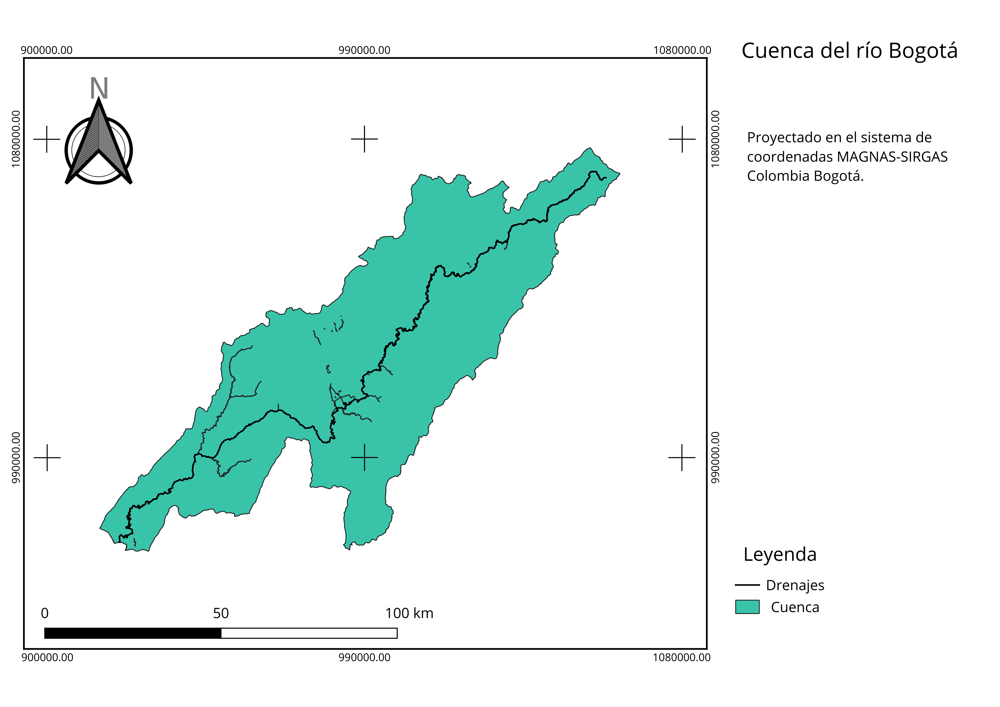

```{r setup, include=FALSE}
knitr::opts_chunk$set(echo = FALSE, 
                      message = FALSE, 
                      warning = FALSE,
                      library(tidyverse), 
                      library(gridExtra))
knitr::knit_hooks$set(plot = function (x, options) {
  float_correct <- function(f, y, opts)  {
    if (is.null(opts$regfloat) || opts$regfloat==FALSE)
      paste0(f(y, opts), "\n\n\\FloatBarrier\n")
    else
      f(y, opts)
  }
  if (!is.null(options$out.width) || !is.null(options$out.height) ||
      !is.null(options$out.extra) || options$fig.align != "default" ||
      !is.null(options$fig.subcap)) {
    if (is.null(options$fig.scap))
      options$fig.scap = NA
    return(float_correct(knitr:::hook_plot_tex, x, options))
  }
  return(float_correct(knitr:::hook_plot_md_base, x, options))
})
```

# Resúmennnnnnnn

# Introducción

El río Bogotá es una cuenca que atraviesa parte de la zona central de Colombia, esta se sitúa en el departamento de Cundinamarca, empieza en el municipio de Villapinzón y desemboca en el río Magdalena [@Pinzon]. Está conformada por 19 subcuencas, y compuesta por un sistema natural de quebradas, ríos, lagunas, y humedales (en su mayoría afluentes del río Bogotá) [@calidad_neusa].
Diversos estudios han focalizado sus esfuerzos en analizar las influencias tanto de origen natural como antrópico de los sistemas hídricos. En las aguas del río Bogotá se evidencian todo tipo de influencias antrópicas, ejercicios como la tala de árboles, captación de aguas ilegales, depositos de residuos domésticos, residuos industriales y una predominante falta de interés por el uso responsable de sus aguas, la convierten en un referente de suciedad y contaminación a nivel mundial [@car_intro]. La importancia de su conservación aumenta si se considera el hecho de que esta cuenca abastece a más de 10 millones de habitantes de los 46 municipios que la conforman y desarrollan todo tipo de actividades socioeconómicas que le permiten subsistir en su diario vivir, así como todos los demás seres vivos que la habitan, cuya supervivencia depende de qué tan deteriorado se encuentre su ecosistema [@car_intro]. El presente estudio trata de analizar de la forma más minuciosa posible la cuenca del río Bogotá, y posteriormente elaborar una caracterización que abarque todos los aspectos que conforman a la cuenca como unidad (desde los factores morfométricos hasta los socioeconómicos), cuya consulta permita conocer su estado hasta la fecha de publicación del estudio. Adicionalmente se harán recomendaciones desde la perspectiva (y el campo que le compete) a la Ingeniería y las ciencias forestales que pueden servir como retroalimentación para los entes que se encargan del manejo de la cuenca del río Bogotá. 


# Metodología

- Polígonos en formato "shape" para la delimitación de la cuenca del río Bogotá, y las subcuencas que la conforman en el portal web (https://datosgeograficos.car.gov.co/datasets/ed418474401f49baa2931e35dd7a8919). Con estos se elaboró el mapa de la delimitación de la cuenca con su cauce principal, como de las subcuencas, todo por medio de las herramientas vectoriales del paquete básico de qgis.
- Imágenes satelitales LandSat 8 entre las coordenadas aproximadas (5.25, -73.65) y (4.26, -74.78) del 17 de Marzo del año 2018 para el mapa de coberturas (Información obtenida de U.S. Geological Survey). Se procesaron en los programas de sistemas de información geográfica QGIS [@QGIS_software]. Primero se hizo la corrección atmosférica para cada una de las dos imágenes con la extensión Semi-Automatic Classification Plugin (SCP), posteriormente se elaboró una clasificación de coberturas no supervisada con la extensión dzetsaka.
- Bases de datos de precipitación y temperatura del portal “datos.gov.co” y proporcionadas por POMCA Río Bogotá, se analizaron con el software estadístico R en su versión 4.0.3 [@R]. Se transformaron a formato largo con ayuda de la librería TidyR, se depuró y se obtuvo la información resúmen para cada subcuenca y la cuenca completa con la librería dplyr y se graficaron con la librería ggplot2, todas las librerías anteriores pertenecientes a la librería Tidyverse [@tidyverse].
- Para el presente artículo se utilizaron las planchas integradas de la cuenca del río Bogotá del Convenio "Fondo de adaptación" del Instituto Geológico Agustín Codazzi (IGAC) a escala 1:25.000, con información de redes de drenajes y curvas de nivel disponibles en su sitio web (https://geoportal.igac.gov.co/contenido/convenios-igac) [@convenio_igac]. Se obtuvo la morfometría de la cuenca, mediante la tabla de atributos que estos mismos tenían, y aplicando las fórmulas que se mencionan a continuación. Posteriormente se elaboró la tabla resúmen con la librería kableExtra [@kableextra] del lenguaje de programación R.

- **(P):** Longitud de la divisoria de aguas, o perímetro.

- **(L):** Longitud de la cuenca.

- **Ancho de la cuenca (B):** Es la relación entre el área y la longitud de la cuenca.
 
$$B = \dfrac{A}{L}$$
 
- **Factor de forma (Kf):** Es la relación entre el área y el cuadrado de la longitud de la cuenca. Se busca determinar qué tan cuadrada o alargada es una cuenca.
 
$$Kf = \dfrac{A}{{L}^2}$$
 
Si $Kf>1$, entonces la cuenca es más achatada, por lo que tiene un río principal más corto y un mayor riesgo de crecidas.


- **Coeficiente de compacidad (Kc):** Es la relación entre el perímetro de la cuenca (P) y la longitud de la circunferencia de un círculo de igual área a la de la cuenca.

Si $Kc=1$, entonce la cuenca es circular.

$$Kc = 0.28\dfrac{P}{{A}^{1/2}}$$
 
Si $Kc \approx 1$, habrá una tendencia a concetrar mayores volúmenes de agua.
 
 
- **Tiempo de concentración (Tc):** El tiempo que tarda una gota de agua en fluir desde el punto más remoto hasta la salida de la cuenca. O el tiempo mínimo necesario para que toda la cuenca esté aportando agua al punto de salida (según Kirpich). Generalmente está expresada en minutos. Una fórmula generalizada para hallar el tiempo de concentración es:

$$Tc = 0,066{\dfrac{L}{\sqrt{S_0}}}^{0,77}$$
Pero para la cuenca del río Bogotá, se elaboró un ajuste que concluye en la siguiente ecuación. 

$$Tc = {\left(11.9 \times \frac{{(\frac{L}{1.6})}^3}{0.3}\right)}^{0.385}$$


# Resultados

```{r fig.cap='Mapa de drenajes de la cuenca del rio Bogotá.'}

```

```{r fig.cap='Perfil Longitudinal', out.width='70%', fig.align='center'}
knitr::include_graphics("perfil_longitudinal.png")
```

```{r fig.cap='Distribución  de  los  diferentes  rangos  de  pendiente,  extensión  territorial  y porcentual para la totalidad de la cuenca del río Bogota  (Tomada de Consorcio Planeación Ecológica – Ecoforest. 2006.)'}
knitr::include_graphics("pendientes_tabla.png")
```

```{r fig.cap='Parámetros morfométricos', out.width='50%', fig.align='center'}
knitr::include_graphics("morfometria.png")
```

```{r fig.cap='Subcuencas de la cuenca del río Bogotá.'}
knitr::include_graphics("Subcuencas.png")
```


```{r fig.cap='Temperaturas medias de las subcuencas del río Bogotá'}
t_mean <- read.csv("Temperaturas_Medias.csv") %>%
  pivot_longer(
    ENERO:DICIEMBRE, 
    names_to = "MES", 
    values_to = "Tc"
  ) %>% 
  mutate(MES = as.factor(MES), 
         AÑO = as.factor(as.character(AÑO))) %>% 
  arrange(match(MES, c("ENERO", "FEBRERO", "MARZO", "ABRIL", 
                       "MAYO", "JUNIO", "JULIO", "AGOSTO", 
                       "SEPTIEMBRE", "OCTUBRE", "NOVIEMBRE", 
                       "DICIEMBRE"))) %>% 
  mutate(MES = fct_recode(MES, "1" = "ENERO", 
                          "2" = "FEBRERO", 
                          "3" = "MARZO", 
                          "4" = "ABRIL", 
                          "5" = "MAYO", 
                          "6" = "JUNIO", 
                          "7" = "JULIO", 
                          "8" = "AGOSTO", 
                          "9" = "SEPTIEMBRE", 
                          "10" = "OCTUBRE", 
                          "11" = "NOVIEMBRE", 
                          "12" = "DICIEMBRE")) %>% 
  filter(Tc <38)

t_mean$CUENCA <- iconv(t_mean$CUENCA, from = 'UTF-8', to = 'ASCII//TRANSLIT')

t_mean %>% 
  ggplot(data = ., mapping = aes(y = Tc, x = MES)) +
  geom_line() + facet_wrap(~ CUENCA) + aes(x = fct_inorder(MES)) + 
  theme_bw() + xlab("Mes") + ylab("Temperatura (ºC)")
  #geom_col() + aes(x = fct_inorder(MES)) + theme_bw() + 
  #xlab("Mes") + ylab("Temperatura (ºC)") + facet_wrap(~CUENCA)

```

```{r fig.cap='Temperaturas máximas de las subcuencas del río Bogotá'}
t_max <- read.csv("Temperaturas_M_ximas.csv") %>%
  pivot_longer(
    ENERO:DICIEMBRE, 
    names_to = "MES", 
    values_to = "Tc"
  ) %>% 
  mutate(MES = as.factor(MES), 
         AÑO = as.factor(as.character(AÑO))) %>% 
  arrange(match(MES, c("ENERO", "FEBRERO", "MARZO", "ABRIL", 
                       "MAYO", "JUNIO", "JULIO", "AGOSTO", 
                       "SEPTIEMBRE", "OCTUBRE", "NOVIEMBRE", 
                       "DICIEMBRE"))) %>% 
  mutate(MES = fct_recode(MES, "1" = "ENERO", 
                          "2" = "FEBRERO", 
                          "3" = "MARZO", 
                          "4" = "ABRIL", 
                          "5" = "MAYO", 
                          "6" = "JUNIO", 
                          "7" = "JULIO", 
                          "8" = "AGOSTO", 
                          "9" = "SEPTIEMBRE", 
                          "10" = "OCTUBRE", 
                          "11" = "NOVIEMBRE", 
                          "12" = "DICIEMBRE")) %>% 
  filter(Tc <38)

t_max$CUENCA <- iconv(t_max$CUENCA, from = 'UTF-8', to = 'ASCII//TRANSLIT')

t_max %>% 
  ggplot(data = ., mapping = aes(y = Tc, x = MES)) +
  geom_line(na.rm = TRUE) + facet_wrap(~ CUENCA) + aes(x = fct_inorder(MES)) + 
  theme_bw() + xlab("Mes") + ylab("Temperatura (ºC)")
```

```{r fig.cap='El gráfico A corresponde a las temperaturas medias, mientras que el gráfico B corresponde a las temperaturas máximas entre los años 1938 hasta 2019.', out.height='80%'}
t_media_gral <- read.csv("Temperaturas_Medias.csv") %>% 
  pivot_longer(
    ENERO:DICIEMBRE, 
    names_to = "MES", 
    values_to = "Tc"
  ) %>% 
  group_by(MES) %>%
  summarise(t_media = mean(Tc)) %>% 
  mutate(MES = as.factor(MES)) %>% 
  arrange(match(MES, c("ENERO", "FEBRERO", "MARZO", "ABRIL", 
                       "MAYO", "JUNIO", "JULIO", "AGOSTO", 
                       "SEPTIEMBRE", "OCTUBRE", "NOVIEMBRE", 
                       "DICIEMBRE"))) %>% 
  mutate(MES = fct_recode(MES, "1" = "ENERO", 
                          "2" = "FEBRERO", 
                          "3" = "MARZO", 
                          "4" = "ABRIL", 
                          "5" = "MAYO", 
                          "6" = "JUNIO", 
                          "7" = "JULIO", 
                          "8" = "AGOSTO", 
                          "9" = "SEPTIEMBRE", 
                          "10" = "OCTUBRE", 
                          "11" = "NOVIEMBRE", 
                          "12" = "DICIEMBRE"))

t_media_general <- t_media_gral %>% 
  ggplot(data = ., mapping = aes(y = t_media, x = MES)) + 
  geom_col() + aes(x = fct_inorder(MES)) + theme_bw() + 
  xlab("Mes") + ylab("Temperatura (ºC)") + 
  ggtitle("A")


t_max_gral <- read.csv("Temperaturas_M_ximas.csv") %>%
  pivot_longer(
    ENERO:DICIEMBRE, 
    names_to = "MES", 
    values_to = "Tc"
  ) %>% na.omit() %>% 
  group_by(MES) %>%
  summarise(t_maxima = mean(Tc)) %>% 
  mutate(MES = as.factor(MES)) %>% 
  arrange(match(MES, c("ENERO", "FEBRERO", "MARZO", "ABRIL", 
                       "MAYO", "JUNIO", "JULIO", "AGOSTO", 
                       "SEPTIEMBRE", "OCTUBRE", "NOVIEMBRE", 
                       "DICIEMBRE"))) %>% 
  mutate(MES = fct_recode(MES, "1" = "ENERO", 
                          "2" = "FEBRERO", 
                          "3" = "MARZO", 
                          "4" = "ABRIL", 
                          "5" = "MAYO", 
                          "6" = "JUNIO", 
                          "7" = "JULIO", 
                          "8" = "AGOSTO", 
                          "9" = "SEPTIEMBRE", 
                          "10" = "OCTUBRE", 
                          "11" = "NOVIEMBRE", 
                          "12" = "DICIEMBRE"))

t_maxima_general <- t_max_gral %>% 
  ggplot(data = ., mapping = aes(y = t_maxima, x = MES)) + 
  geom_col() + aes(x = fct_inorder(MES)) + theme_bw() +
  xlab("Mes") + ylab("Temperatura (ºC)") + 
  ggtitle("B")

grid.arrange(t_media_general, t_maxima_general, ncol=2)
```


```{r fig.cap='Precipitación anual multianual sectorizada por subcuencas con datos desde el año 1931 hasta el año 2019 de todas las estaciones de medición disponibles que se encuentran dentro del área respectiva a la  cuenca del Río Bogotá.', out.width="80%", fig.align='center', message=FALSE}

pp_mensual <- read.csv("Precipitaciones_Totales_Mensuales.csv") %>%
  pivot_longer(
    ENERO:DICIEMBRE, 
    names_to = "MES", 
    values_to = "PP"
  ) %>% 
  mutate(MES = as.factor(MES), 
         AÑO = as.factor(as.character(AÑO))) %>% 
  arrange(match(MES, c("ENERO", "FEBRERO", "MARZO", "ABRIL", 
                       "MAYO", "JUNIO", "JULIO", "AGOSTO", 
                       "SEPTIEMBRE", "OCTUBRE", "NOVIEMBRE", 
                       "DICIEMBRE"))) %>% 
  mutate(MES = fct_recode(MES, "1" = "ENERO", 
                          "2" = "FEBRERO", 
                          "3" = "MARZO", 
                          "4" = "ABRIL", 
                          "5" = "MAYO", 
                          "6" = "JUNIO", 
                          "7" = "JULIO", 
                          "8" = "AGOSTO", 
                          "9" = "SEPTIEMBRE", 
                          "10" = "OCTUBRE", 
                          "11" = "NOVIEMBRE", 
                          "12" = "DICIEMBRE")) %>% 
  filter(PP < 1500)

pp_mensual$CUENCA <- iconv(pp_mensual$CUENCA, from = 'UTF-8', to = 'ASCII//TRANSLIT')

pp_mensual %>% 
  ggplot(data = ., mapping = aes(y = PP, x = MES)) +
  geom_line(na.rm = TRUE) + facet_wrap(~ CUENCA) + aes(x = fct_inorder(MES)) + 
  theme_bw() + xlab("Mes") + ylab("Precipitación (mm)")

```


```{r fig.cap='Precipitación anual multianual con datos desde el año 1931 hasta el año 2019 de todas las estaciones de medición disponibles que se encuentran dentro del área respectiva a la  cuenca del Río Bogotá.'}

pp_mes_ano <- read.csv("Precipitaciones_Totales_Mensuales.csv")


pp_mes_ano <- pp_mes_ano %>% 
  mutate(AÑO = as.factor(AÑO)) %>% 
  pivot_longer(
    ENERO:DICIEMBRE, 
    names_to = "MES", 
    values_to = "PP"
  ) %>% 
  filter(PP > 0) %>% 
  group_by(MES) %>% 
  summarise(pp = mean(PP)) %>% 
  mutate(MES = as.factor(MES)) %>% 
  arrange(match(MES, c("ENERO", "FEBRERO", "MARZO", "ABRIL", 
                       "MAYO", "JUNIO", "JULIO", "AGOSTO", 
                       "SEPTIEMBRE", "OCTUBRE", "NOVIEMBRE", 
                       "DICIEMBRE")))


pp_mes_ano %>% 
  ggplot(data = ., mapping = aes(y = pp, x = MES)) + 
  geom_col() + aes(x = fct_inorder(MES)) + theme_bw() +
  theme(axis.text.x = element_text(angle = 90)) + 
  xlab("Mes") + ylab("Precipitación (mm)") + 
  theme(plot.title = element_text(hjust = 0.5))
```


- Poner gráfica por subcuencas (y luego por toda la cuenca) de pp, t y radiación.

## Subcuencas

### Río alto

- el  exceso  de  materia  orgánica  agota  el  oxígeno  del agua y por ende, hay una fuerte reducción de la diversidad de especies de macroinvertebrados y de 
organismos acuáticos (10) [@Fajardo].
- La figura 7, muestra la variación de la temperatura del agua a lo largo del tramo del en estudio, en esta se puede visualizar que la temperatura va aumentando significativamente hasta la estación 
AAQQ, y  vuelve  a  descender  en  la  estación QQ. Sin  embargo,  vuelve  a  ascender  los  valores,  encontrando  que  pasados  29.31  km  del  tramo  en  estudio  se  registra  la temperatura más alta con un valor de 19.3°C, pudiéndose inferir que el factor incidente en el aumento de la temperatura del agua puede ser causada por la industria curtidora que se encuentra en el área y a las descargas de aguas residuales del municipio de Villapinzón. Es preciso señalar en que este municipio no cuenta con una planta de tratamiento de sus aguas residuales. Luego, la temperatura vuelve a bajar para la estación PVT lo que se debe a tributarios recibidos por el río en este segmento del trazado analizado. Además de **las condiciones morfológicas del río en este punto que ayudan a autodepurar el cuerpo de agua superficial** [@Fajardo].
- El resto de resultados de @Fajardo.

- Pinzón (curtiembres de villapinzón y chocontá).
  - http://www.scielo.org.co/scielo.php?pid=S0120-00112018000100045&script=sci_abstract&tlng=en
  - http://revistas.unipamplona.edu.co/ojs_viceinves/index.php/RA/article/view/3967
  - Actividades económicas como las curtiembres, agroindustria y minería, contaminan la cuenca alta del Río Bogotá; debido al vertimiento de algunos metales pesados (MP) como el Cromo (Cr), el Mercurio (Hg) y el Arsénico (As). **Esta problemática la afronta el río Bogotá desde su incursión en el casco urbano del municipio de Villapinzón, a solo 8 kilómetros del páramo de Guacheneque en donde nace, hasta su desembocadura en el río Magdalena.**
  - Caracterizadas las aguas del río en el sector del municipio de Chocontá, estas presentaron una coloración más oscura y olores fuertes con presencia de sulfuros, especialmente sulfuro de hidrógeno H 2 S. [@Pinzon]
  - Villapinzón, municipio localizado aguas abajo del páramo de Guacheneque, donde nace el rio Bogotá. [@Pinzon]
  - En el análisis de As las concentraciones obtenidas en los lodos de Villapinzón evidencian la actividad minera que se presenta clandestinamente en el páramo de Guacheneque. [@Pinzon]
  - Curtiembres a 30 metros aumentan las pp en Villapinzón, por lo que el caudal en Chocontá es más alto y arrastra todos los metales pesados vertidos desde Villapinzón, hasta la desembocadura de la cuenca. [@Pinzon]
  - Los animalitos consumen metales pesados. [@Pinzon]
  - El mercurio no es el mayor problema en este río, el cromo con concentraciones tan altas es el principal problema de las autoridades ambientales y de la comunidad debido a su alta afinidad con
los organismos vivos generando bioacumulación e intoxicación de éstos.
  - El municipio de Villapinzón es el mayor generador de vertimientos de MP generados por las 110 curtiembres ubicadas en la ronda del río y los subproductos de sales de cromo son transportados al lecho del río, pero éstos no sedimentan al instante, por lo cual no se identifican concentraciones superiores a 219 mg/kg, aunque este valor sigue siendo superior a los máximos permisibles de la resolución 631 de 2015.
  - El municipio de Chocontá con menos de 50 empresas dedicadas a la curtiembre presenta concentraciones de Cr superiores a los 690 mg/kg, valor muy superior a Villapinzón por más de 633,5 mg/Kg Cr en la segunda toma de muestras, lo cual se debe al caudal del agua que aumenta conforme las condiciones meteorológicas cambian.
  
#### Tominé

En lugares como la cuenca Tominé se presenta un alto gradiente climático y diversos ecosistemas, los asentamientos cambiaron el flujo del agua, en guatavita hay actividades agrícolas y ganaderas, vertimientos de aguas residuales domésticas e industriales (cultivo de flores) provenientes del municipio de Guatavita [@cuenca_tomine].
Debido a la utilización de químicos en la cuenca alta, y la degradación de las coberturas vegetales cercanas al Embalse de Tominé, el "buchón" invadió más de 300 hectáreas. La creación de este embalse llevó a que los habitantes de las zonas rurales cambiaran sus trabajos y pasó tener una economía productiva, a una turística con senderos, miradores, la nueva tendencia de los "Glamping", y avistamiento de fauna y flora [@multifuncionalidad_tomine].

#### Neusa

- Esta subcuenca presenta la mayor área de cultivos con 11875 Ha, respecto a las 32546,93 Ha destinadas para actividad agrícola en la cuenca alta del Río Bogotá, conformada por cultivos mixtos; su mayor representación está conformada por la heterogeneidad de la cobertura debido al tamaño reducido de los predios, su cobertura vegetal se denomina herbácea – pastos, que tiene un uso pecuario actualmente de tipo semi-intensivo y extensivo [@calidad_neusa].
- la economía se basa en el desarrollo de actividades relacionadas con siembras, criaderos de truchas, actividades avícolas y principalmente actividades de pastero alrededor de la zona, lo cual influye directamente sobre la calidad del agua [@calidad_neusa].
- un incumplimiento en los parámetros de Hierro, Turbiedad, Coliformes Totales y E. coli [@calidad_neusa].
- Durante las visitas de inspección sanitaria se evidencio en campo que los vertimientos que se presentan alrededor del tramo son principalmente de origen doméstico, y en menor escala producto de las actividades agrícolas y ganaderas, ya que en general los predios encuestados se dedican exclusivamente al pastoreo y a la siembra de pequeñas parcelas de maíz y papa, y únicamente un predio se dedica exclusivamente a la actividad de crianza de truchas, en donde las características del agua mejoraron notablemente [@calidad_neusa].

### Parte baja

- Según otros estudios realizados aguas abajo por Pinzón (2018) en el municipio de Cajicá, se encontraron concentraciones hasta de 18,5 mg/kg de Hg. [@Pinzon]

## Geología

El área de la Sabana de Bogota, esta ubicada en la cordillera Oriental abarca la zona axial y el  inicio  de  sus  flancos  oriental  y  occidental, sus rocas abarcan edades desde el Cretácico inferior hasta el Cuaternario [@Geologia].

El Cretácico inferior se compone de las formaciones Trinchera, Socota, Capotes, e Hiló, hacen parte de la parte baja de la cuenca del río Bogotá (ver la Figura 4. delimitado en color rojo).
Las rocas del Cretácico superior afloran en la parte central de la cuenca, así como sus flancos oriental y occidental, estas corresponden a las formaciones Simijaca, La Frontera, Conejo, Grupo Guadalupe, y Grupo Olini (Éste último sólo aflora en la parte baja de la cuenca del río Bogotá) [@Geologia].


```{r fig.cap='Mapa geológico de la cuenca del rio Bogotá (Tomado de INGEOMINAS).'}

```


### Cretácico inferior

  **Formación Trincheras:** Con este nombre se hace referencia a la suceción de lodolitas con intercalaciones de calizas y arenitas en la parte inferior del Grupo Villeta. Esta ha sido dividida en segmento inferior (calizo arcilloso) y superior (arcilloso), también denominados como miembros El Tigre y Anapoima respectivamente [@cretacico].
  
  **Formación Socotá:** Compuesta por areniscas fosilíferas, "shales" grises, lutitas y margas fosilíferas y el "Horizonte de Esferitas" de HUBACH [@cretacico].
  
  **Formación Capotes:** Limitada en la base por el Miembro Socotá y en el techo por la Formación Hiló [@cretacico].
  
  **Formación Hiló:** Antes conocida como Horizonte de Hiló, pero luego ascendida a Formación. En base limita con Miembro Capotes, y en techo por la unidad de lodolitas indenominadas [@cretacico].
  

### Cretácico Superior

  **Formación Simijaca:** Unidad de lodolitas laminadas. Limita en la base con la Formación Hiló y su techo es la Formación La Frontera [@cretacico].
  
  **Formación La Frontera:** Capas silíceas, en la base rocas calizas o concreciones calcáreas, mientras que su tope se marca por la capa más jóven de chert del conjunto superior de la unidad, infrayaciendo la Formación Conejo[@cretacico].
  
  **Formación Conejo:** Este nombre reemplaza la unidad de lodolitas indenominadas K8, límite inferior por la última capa silícea de la Formación La Frontera, su límite superior se sitúa por debajo de las arenitas de la Formación Arenisca Dura [@cretacico].
  
  **Grupo Guadalupe:** Tiene como base la primera ocurrencia de arenitas de la Formación Arenisca Dura por encima de las lodolitas del Grupo Villetas. Su techo se dá en la primera ocurrencia de lodolitas de la Formación Guaduas [@cretacico]. Este grupo es en su mayoría arenoso, aunque Hubach 1957 lo divide en un conjunto inferior arcilloso y otro superior arenoso.
  
  **Grupo Olini:** Se sitúa por encima de la Formación Lomagorda y e infrayace al Nivel de Lutitas y Arenas [@cretacico].


## Geomorfología


La cuenca del río Bogotá podría decirse que se divide en dos partes, una es el **Altiplano con las subcuencas de sus bordes** (Todo lo que está aguas arriba de la garganta del río Bogotá en los cerros de Boquerón) y la otra que comprende **desde el Altiplano hasta su desembocadura en el río Magdalena.**
Esta cuenca está situada sobre u sustrato sedimentario plegado y fallado, en el cuál hay depresiones tecto-sedimentarias. En la cuenca los escarpes de origen tectónico son bastante comunes. La "Sabana de Bogotá" es la mayor formación estructural que constituye el altiplano, aunque no es un término técnico, pues cuando se menciona a la "Sabana de Bogotá" se hace referencia a la sedimentación de un lago formado desde la segunda parte del periodo Terciario. A lo largo y ancho de la cuenca también se presentan colinas y relieves más fuertes y accidentados; Se sabe que las colinas suaves provienen de rocas arcillosas y los relieves fuertes son derivados de areniscas. En la parte baja de la cuenca (relieves bajos en relación al nivel del mar) son comunes los perfiles profundos de meteorización (Más que todo en las zonas con climas tropicales de tendencia seca). Por otra parte en las divisorias de las subcuencas afloran las alteritas de color rojo intenso (ver Figura 5.), divisorias con estos colores rojos se pueden ver en Neusa, Teusacá, Checua, divisoria derecha del Alto de Bogotá, entre otros. Un significado o interpretación de el avistamiento de alteritas, es una inminente situación de peligro ambiental (Erosiones verticales u horizontales) [@CAR].


```{r fig.cap='Tomada de @alterita'}
knitr::include_graphics("alteritas.png")
```

Acontecimientos como el levantamiento de la cordillera, derivaron en aumentos del potencial hidro-gravitacional, ejemplos de esto son: río Tunjuelito, Subachoque, Siecha y Teusacá.
Así como la cordillera oriental, una de las formas estructurales más relevante de la cuenca es el altiplano, definida como una depresión tecto-sedimentaria subsidente (Van Der Hammen, 1995) ha sido el espacio ocupado por varios niveles lacustres en la medida en que la cordillera fue emergiendo hasta su altitud actual. En el Plioceno Temprano exisió un lago que cubría la parte central del altiplano y  las subcuencas Subachoque, Sisga, Siecha, Soacha, Muña, y Alto de Bogotá. Un descenso lacustre que ocurrió hace 40.000 años convirtió este antiguo lago, en lo que hoy conocemos como altiplano. El descenso en el nivel del lago ocasionó la formación de distintos niveles de terrazas por disección. Embalses de la cuenca como Neusa, Sisga, Tominé y Muña imitan el paisaje de cuando el altiplano era un lago.
La formación de glaciares se dio en  altitudes superiores a 3.000 m. Abajo de los  espacios  cubiertos  con  hielo  hubo  un  cinturón  o  piso en el que por restricciones térmicas no había vegetación y las frecuentes nevadas generaban un escurrimiento (por fusión), arriba del páramo de ese momento, es decir arriba de los 2.750 m. aproximadamente [@CAR].

 
- Tabla
  - Reptación: Es un proceso discontinuo en el que una o varias partículas se desplazan principalmente pendiente abajo.
  - Disección: Corte sobre los suelos por acción del agua encauzada.
    - Corrientes mayores: En la cuenca media y alta, la disección es discreta. En la cuenca baja los drenajes no ejercen disección activa. En las terrazas altas se presentan encharcamientos, en las bajas escurrimientos por desbordes, y en unas pocas terrazas se presenta la sufosión (Escurrimiento sub-superficial con formación de túneles).
    - Red menor de drenaje: Cuando se analiza la cartografía, se observa una red densa de drenajes, pero en realidad pueden no llevar agua. En la cuenca del río Bogotá, la mayoría de los cauces elementales no llevan agua.
  - Escurrimiento superficial: Si hay agua, lluvia, y pendiente, el agua escurre en la parte superficial. Si es erosivo o no, depende de la cobertura vegetal. Los lugares en vía de desertificación de la cuenca río Bogotá son la cuenca media y alta de Checua, cuenca media y baja de Siecha, alrededores del embalse Tominé, Cerros Mondoñedo, el Fute, cuenca baja del río Bastillas, vertiente derecha del río Bojacá, las vertientes izquierda derecha en la parte media y baja del Alto de Bogotá. Todas presentan surcos, cárcavas (por sufosión) y truncamiento de suelos.
  - Movimientos en masa:
    - Desprendimientos
    - Derrumbes
    - Solufluxion
    - Deslizamientos rotacionales
    - Deslizamientos en plancha
    - Flujos torrenciales
  - Sedimentación

## Suelos

En la cuenca del río Bogotá, los tipos suelos son variables debido a la cantidad de pisos térmicos que allí se tienen (Extremadamente frío húmedo, Muy frío muy húmedo, Frío muy húmedo, Frío húmedo, Frío seco, Medio húmedo, Cálido húmedo, Cálido seco). [@CAR]

- En los climas Extremadamente fríos húmedos, se encuentran suelos bien drenados, generalmente de texturas gruesas y limitados por fragmentos de roca.
- En climas Muy fríos muy húmedos los suelos son bien a excesivamente drenados, profundos a superficiales, texturas medias a finas (aunque en algunos lugares pueden ser moderadamente gruesas) en lugares mayormente erosionales. En las laderas de acumulación los suelos son pobremente drenados, muy superficiales y poco evolucionados.
- En clima Frío muy húmedo los suelos tienen un buen drenaje, con texturas finas a moderadamente gruesas y profundos a superficiales limitados con el material parental.
- La unidad climática predominante es Frío húmedo, de los suelos que se encuentran en esta unidad, la mayoría son bien drenados, texturas moderadamente finas a moderadamente gruesas en laderas erosionales y texturas finas en los Planos de terraza, tienden a ser profundos (siendo más profundos en las terrazas) y algunos están limitados por horizontes argílicos.
- En clima Frío seco la mayoría presentan un buen drenaje (Excepto en los Planos de inundación donde el drenaje es muy pobre), en Laderas erosionales tienen texturas finas y son moderadamente profundos a superficiales, mientras que en los Planos de terraza son de textura ligeramente más gruesa y más profundos.
- En clima Medio húmedo los suelos tienen un buen drenaje, son de texturas moderadamente finas, de moderadamente profundos a profundos (Aunque en algunos lugares son superficiales limitados por fragmentos de roca).
- En clima Cálido húmedo son bien drenados, profundos y de texturas finas a moderadamente finas.
- En clima Cálido seco los suelos son bien drenados, de texturas finas a moderadamente gruesas, y pueden ser desde muy superficiales a profundos.

## Factores Bióticos

### Diversidad de especies vegetales

```{r}
spp <- read.csv("biodiversidad_car.csv")
```

 - @herbario_car
 - @multifuncionalidad_tomine y @cuenca_tomine
 - @macroinvertebrados

## Componentes Socioeconómicos

En  general,  para  toda  la  cuenca  del  río  Bogotá,  las  amenazas  relacionadas  con inundaciones y movimientos en masa son localizadas y, desde luego, más relevantes por su  ocurrencia  en  tiempos  cortos  y  los  riesgos  que  de  ahí  se  derivan,  además,  se  les  da mayor  publicidad.  Sin  embargo,  y  aunque  desde  la  geomorfología  se  trata  de  una  visión parcial,  con  base  en  las  evidencias  en  campo,  se  plantea  una  amenaza  socio-ambiental en relación con los efectos del escurrimiento superficial con erosión se suelos, obturación de cauces, desaparición de lagunas por sedimentación y, de ahí, una inseguridad frente a la  producción  agropecuaria  y,  también,  una  inseguridad  hídrica  para  la  población.  Para áreas extensas dentro de la cuenca, más que amenazas, se trata de impactos ya en curso y con duraciones más largas, a veces menos perceptibles y, también, menos conocidas.  

- @neusa_calidad
- @parasitos

# Conclusión

# Agradecimientos

# Bibliografía